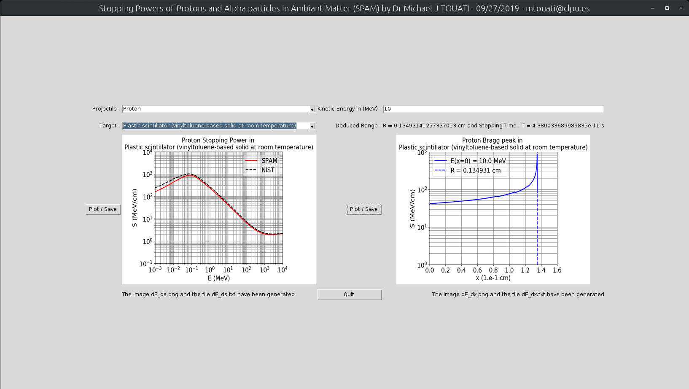

[](https://www.python.org/)
[](https://numpy.org/)
[](https://matplotlib.org/stable/index.html#)
[](https://docs.python.org/3/library/tkinter.html)
[](https://www.latex-project.org//)
[](https://www.gnu.org/licenses/gpl-3.0)
[](CODE_OF_CONDUCT.md)
[](https://github.com/michaeltouati/SPAM/releases)
[&query=count&url=https://github.com/michaeltouati/SPAM/blob/master/.github/view.json?raw=True&logo=github)](https://github.com/michaeltouati/SPAM/actions/workflows/views.yml)
[&query=count&url=https://github.com/michaeltouati/SPAM/blob/master/.github/clone.json?raw=True&logo=github)](https://github.com/michaeltouati/SPAM/actions/workflows/clones.yml)
[](https://github.com/michaeltouati/SPAM/issues)
[](https://github.com/michaeltouati/SPAM/issues)
[](https://github.com/michaeltouati/SPAM/pulls)
[](https://github.com/michaeltouati/SPAM/pulls)

# SPAM
Written by Michaël TOUATI  - 09/27/2019

<p align="center">
  
</p>

SPAM (Stopping Power of Protons and Alpha particles in Ambiant Matter) is a python tool allowing for printing and saving the stopping power and/or the Bragg's peak of protons or alpha particles in ambiant matter. Equations computed by SPAM are detailed in the spam.pdf file. The comparisons with [PSTAR](https://physics.nist.gov/PhysRefData/Star/Text/PSTAR.html) and [ASTAR](https://physics.nist.gov/PhysRefData/Star/Text/ASTAR.html) NIST databases that has been used to validate SPAM can be found in the benchmarks.tar.xz file. 

SPAM needs the following Python packages :
- tkinter
- PIL 
- numpy 
- matplotlib

The next release will take into account the angular scattering of protons and alpha particles using a Monte-Carlo approach. 

In order to use it, download or clone it and just type

```sh
python3 spam.py
```

The tkinter window will pop up.

